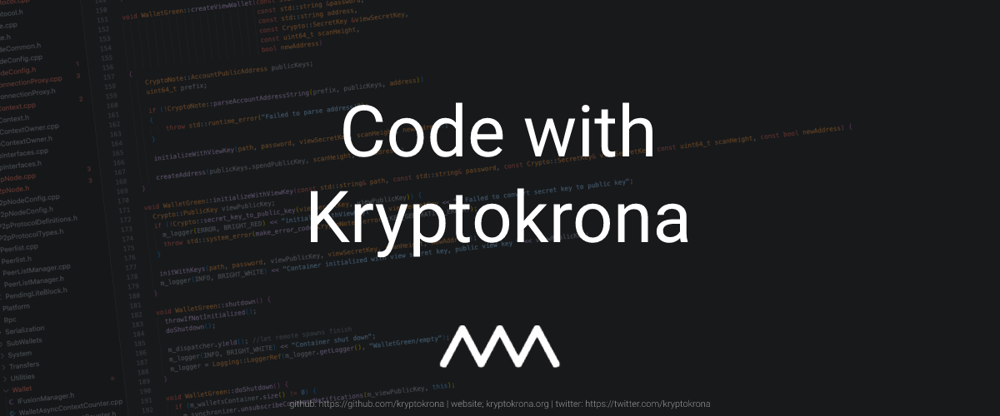

# Code with Kryptokrona

Kryptokrona is a decentralized blockchain from the Nordic based on CryptoNote, which forms the basis for Monero, among others. CryptoNote is a so-called “application layer” protocol further developed by TurtleCoin that enables things like: private transactions, messages and arbitrary data storage, completely decentralized.

Code with Kryptokrona is an initiative to help people learn more about programming, blockchain technology, cryptography, p2p, cryptocurrency, build tools, VCS, databases and much more. This aims both for people who have not programmed before, intermediate and experienced developers who want to learn more about the subjects or just curious or want to start contributing to our project.

# Table of Contents
- [Setup](#setup)
- [Contact](#contact)
- [License](#license)

# Setup

Code with Kryptokrona will occur every second Tuesday at 19-21 GMT+2 (Stockholm time) in Discord in our voicechannel "Code with Kryptokrona". For more information regarding the event please ask it in our Discord server. Link is on our website.

Every time we meet in Discord we will have one person that will screen share either with live coding of doing some concrete implementation that is needed or a walkthrough of some technology how it functions. But as with every session it's an open forum where you can ask questions to experienced developers. 

This setup might change during time so please keep update with this information here on this repository.

# Contact

Contact person of this event is Marcus Cvjeticanin, send a DM on Discord if you have any questions or in our general channel on Discord.

# License

The license is GPL-3.0 License.
